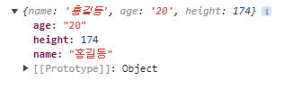
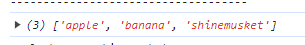

## Javascript

## 1.특징

* script언어(이름에 script없어도 script언어일 수 있음)
* 혼자서 실행X
* html을 도와주는 언어
* java랑 아무관련없음
* 2015 ECMA6등장 . 그 이전것들은 레거시, 자바스크립트도 레거시
* 객체: 복잡한 데이터를 간단하게 쓸 수 있게 묶어놓은 형태

| 객체 기반 언어                      | 객체 지향 언어              |
| ----------------------------------- | --------------------------- |
| 객체 지향 언어를 흉내냈다고 보면 됨 | 객체를 제대로 사용하는 언어 |

## 2.사용방법

* 자바 스크립트도 html과 같이 컴파일러(번역기)가 웹브라우저에 내장되어있어서 따로 컴파일러가 필요없음
* css와 똑같이 inline, internal, external방식이 있음

##### **inline방식**

* inline방식은 가급적 쓰지않는게 좋음

##### internal방식

```html
<head>
    <script> /*javascript문법*/
        window.alert("hello world!");
    </script>
</head>
```

##### external방식

* 보편적이고 가장 바람직한 방식

`hmtl`

```html
<head>
    <script src="/JavascriptWork/external.js"></script>
</head>
```

`javascript`

```javascript
window.alert("이것은 외부에서 실행되는 스크립트입니다.")
```

##### 주석

* // : 한줄 주석
* /* ~ */ : 여러줄 주석

---

## 3.문법

##### (1)변수(Variable): 변할 수 있는 값을 저장할 수 있는 임시 기억(저장)장소

변수 선언

* var, let, consst (var는 거의 안씀)
* 변수 선언을 하면 값을 바꿀때 같은 장소에 저장되므로 공간 낭비 없음
* 변수의 반대 : 상수(똑같이 임시 기억 장소인데, 변경할 수 없는 값)
* 변수 이름은 의미없이 지으면 안됨
* 변수에 초기값을 넣는 것: 초기화(initialization)

변수 표기법

* `.dash-case`(kebab-case)
  * 예시 : the-quick-brown-fox
* `snake_case `(html, css에서 주로사용)
  * 예시: the_quick_brown_fox
* `camelCase `(JS)
  * 예시: theQuickBrownFox
* `PascalCase`(JS)
  * 예시: TheQuickBrownFox

---

##### (2)Data type

1.String

```javascript
// String
let str1 = "Hello";
let str2 = '1234' ;

//backtick
// " " 차이는 문자열 안에 변수를 불러올 수 있음
let str3 = `hello ${str2}`;
```

2. number

```javascript
 //Number
let num1 = 100;
console.log(num1 + 2);
//자바와 다르게, 실수도 한꺼번에 변수지정 가능
let num2 = 3.14;
let num3 = .2;
console.log(num1 + num2);
```

```javascript
//실수 계산  
num1 = 0.1;
num2 = 0.2;
console.log(num1 + num2);
/* 컴퓨터는 정수계산밖에 못하므로 
3. 0000004 라는 값이 나옴
뒤에는 오차값.  그래서 정리해야함*/
console.log((num1 + num2).toFixed(1));
//그리고 타입은 String이 됨

//String 타입을 number타입으로 바꿔주는 방법
Number((num1+num2).toFixed(1))
```

3.Boolean: true of false

```javascript
//Boolean
let b1 = true;
let b2 = false;
```

4.Undefined: 선언만 되어있고, 값이 할당되지 않은 상태

```javascript
let un1;
```

- 이럴 경우 이 값은 사용하지 못함

5.Null: 물리적으로는 값이 있는데, 비어있는 상태. 특별한 목적으로 만들어진 값

```javascript
let age = null;
//기존 값을 청소해준다고 생각하면됨
```

6.Object: 객체

-객체는 포장지라고 생각하자

```javascript
//선언 방법 1
let user = new Object();
user1.name = "홍길동";
user1.age = "17";
user1.heigt = 167;
//user가 변수를 묶어주는 변수가된것.

//선언 방법2
let user2 = {
name: "임꺽정",
age: "20",
height: 187
}

```

-출력하면 묶여있는 객체가 보임



-묶여있는 객체를 꺼내오는법

```javascript
//묶여있는 객체에 접근해서 꺼내오는 방법1
console.log(user1.name, user1.age, user1.height);
  
//방법2
console.log(user1["name"], user1["age"]);
```

-객체 안에 다른 객체 불러오기가 가능

```javascript
let userA = {
	name: "홍길동",
 	age : 30
        }

let userB = {
          name: "임꺽정",
          age : 32,
          friend : userA //다른 객체 불러올 수 이음
        }

```

-userB를통해 userA 불러오는법

```javascript
console.log(userB.friend.name);
console.log(userB["friend"].name);
console.log(userB["friend"]["name"]);
```

7.Array

```javascript
//Array: 배열, 여러개를 쓰기좋게 하나로 묶어조는것
let fruit1 = "apple";
let fruit2 = "banana";
let fruit3 = "shinemusket";
  
let fruits = new Array("apple","banana","shinemusket");
//객체와의 차이 
//객체는 키: 값 형태로 값을 정하는데, 배열은 바로 값을 넣음.
```

-출력될 때 : 객체와 다르게 [ ] 로 묶여나옴



```javascript
//값을 꺼낼 때는 index를 써서 꺼내야함. 순서데이터=index,순서는 0부터
console.log(fruits[0],fruits[1],fruits[2]);
//키가 없기 때문에 "."을 쓰지못하고 []를 써서 접근해야함

```

8.Function

데이터 타입을 확인하는 문법

```javascript
//데이터 타입을 알려주는 문법
console.log(typeof(str1), typeof(num1));
```


---


### Operator

javascript 관련 공식 사이트

https://developer.mozilla.org/ko/docs/Web/JavaScript/Guide/Expressions_and_operators

**연산자의 우선순위**

연산자가 섞였을 때, 

산술연산자 > 비교연산자 > 논리연산자 > 할당연산자

괄호를 사용해서 우선 연산자를 잘 선택하자 


1.산술연산자

```javascript
//산술 연산자(++, --)
let num = 10;
  
num++; // num=num+1
console.log(num);

//let num1 = ++num;
let num1 = num++;
console.log(num1, num);  
/*다른 변수에 넣을 때는, 후위증가와 전위증가 차이가 있기 때문에 조심해야함.
후위증가는 let num1에 값을 먼저 넣고, 증가가 되기 때문.
그래서  num을 찍으면 증가된값이 나오긴 함.*/

```

2.비교연산자

```javascript
let num1 = 10;
let num2 ="10";

console.log(num1 == num2);
//true. 타입이 아니라, 값자체를 비교하는 것이므로

console.log(num1 === num2);
//false. 타입을 비교해주는 연산자이므로.

console.log(num1 !== num2);
//false. 값 자체가 같지 않다고 썼으므로.

console.log(num1 !=== num2);
//true. 타입이 같지 않냐고 물어봤으므로.
```

```javascript
let num1 = 0;
let num2 = false;
console.log(num1 == num2);
//true. 0은 부정의 의미가 있으므로

console.log(num1 === num2);
//false. 타입은 다르므로.
```

3.논리연산자

4.할당연산자


---

### Control statement(제어문)

1.조건문(if, switch)

** 참고로 한 줄일 때는  { }생략가능

```javascript
if(조건) {
	실행코드-> 조건이 무조건 참이라는 전제
}

//거짓인 경우도 적으려면
if(조건) {
	실행코드
}else {
	실행코드
}
```


2.반복문
